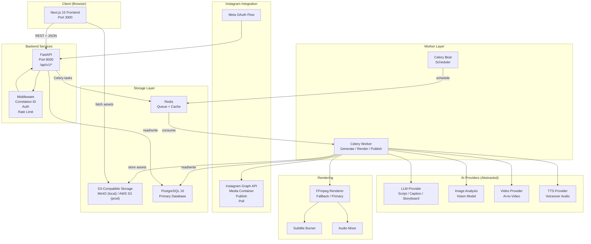
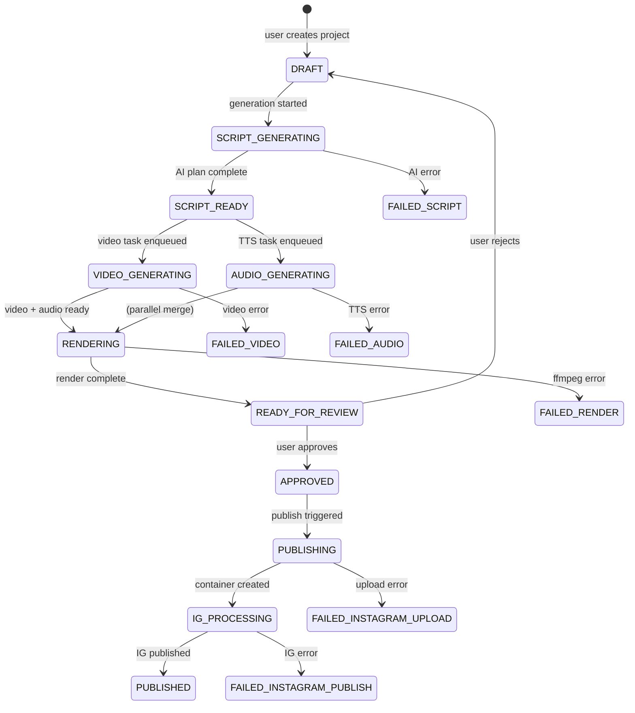
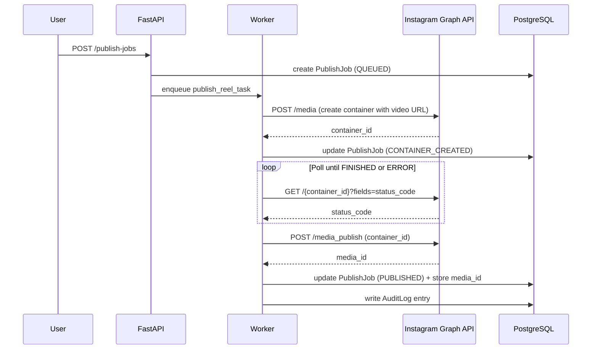

# System Architecture — AI Reel Studio

**Version:** 0.1.0
**Last Updated:** 2026-05-03

---

## 1. System Architecture Diagram



---

## 2. Service Boundaries

| Service         | Responsibility                                           | Port  |
|-----------------|----------------------------------------------------------|-------|
| `apps/web`      | User interface, routing, state management               | 3000  |
| `apps/api`      | REST API, auth, job dispatch, status queries             | 8000  |
| `apps/worker`   | Async job execution (AI, render, publish)                | N/A   |
| PostgreSQL      | Persistent data: users, projects, jobs, logs             | 5432  |
| Redis           | Celery message broker + result backend + cache           | 6379  |
| S3/MinIO        | Binary asset storage (images, video, audio)              | 9000  |
| Meta Graph API  | Instagram OAuth + Reels publishing (external)            | N/A   |

---

## 3. Data Flow

### 3.1 Project Creation Flow
```
Browser → POST /api/v1/reel-projects
       → API creates ReelProject (DRAFT)
       → API creates MediaAsset record
       → S3 pre-signed upload URL returned
       → Browser uploads image directly to S3
       → Browser PATCH /api/v1/reel-projects/{id}/start-generation
       → API creates GenerationJob (QUEUED)
       → Celery task enqueued → Worker picks up
```

### 3.2 AI Generation Flow
```
Worker: generate_creative_plan_task
  → fetch image from S3
  → image analysis (Vision provider)
  → LLM: generate script/storyboard/caption/hashtags
  → validate JSON output against schema
  → moderation check
  → save ReelVersion (SCRIPT_READY)
  → enqueue generate_audio_task
  → enqueue generate_video_task (or fallback render)
```

### 3.3 Rendering Flow
```
Worker: render_reel_task
  → fetch image from S3
  → fetch audio from S3 (if TTS complete)
  → FFmpeg: compose 9:16 MP4 with subtitles + audio
  → upload MP4 + thumbnail to S3
  → update ReelVersion (READY_FOR_REVIEW)
  → notify via WebSocket or polling
```

---

## 4. Worker / Job Flow



---

## 5. Storage Flow

```
User Image Upload:
  Browser → API (get pre-signed URL) → Browser → S3 (direct upload)

Asset Storage:
  Worker → S3 (store audio, video, thumbnail)
  S3 path pattern: {workspace_id}/{project_id}/{version_id}/{asset_type}.{ext}

Instagram Publish:
  Worker → Instagram API (provide S3 public URL for media container)
  Instagram → pulls media from S3 URL
  S3 bucket must allow public read for IG-accessible objects (scoped TTL)
```

---

## 6. Instagram Publishing Flow



---

## 7. Security Boundaries

```
Internet ──► Nginx/LB ──► Frontend (Next.js, no direct DB access)
                      ──► API (FastAPI, JWT-validated routes)
                               │
                               ├── DB: internal network only
                               ├── Redis: internal network only
                               └── S3: IAM role / env-based credentials

Worker: internal only, never exposed to internet
Meta OAuth: handled via API callback, tokens encrypted at rest
Secrets: environment variables only, never in code or logs
```

---

## 8. Architectural Decisions

See [`docs/DECISIONS/`](./DECISIONS/) for all Architecture Decision Records (ADRs):

- [ADR-0001: Tech Stack Selection](./DECISIONS/ADR-0001-tech-stack.md)
- [ADR-0002: Instagram API Strategy](./DECISIONS/ADR-0002-instagram-api.md)
- [ADR-0003: Video Provider Abstraction](./DECISIONS/ADR-0003-video-provider-abstraction.md)
